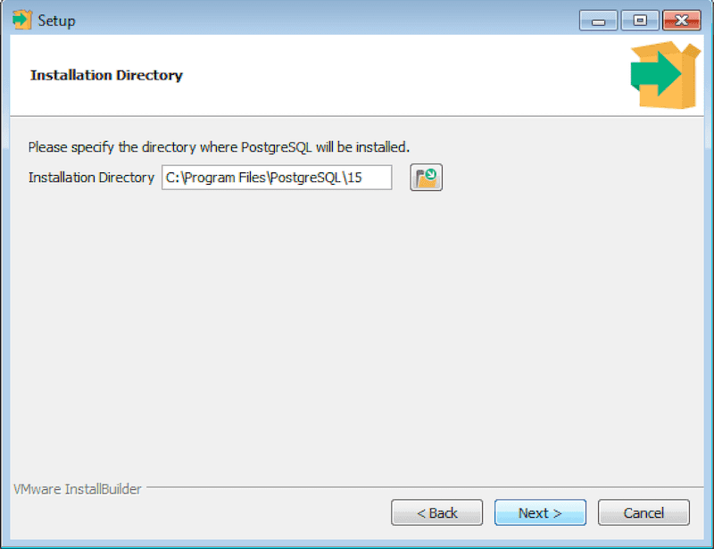
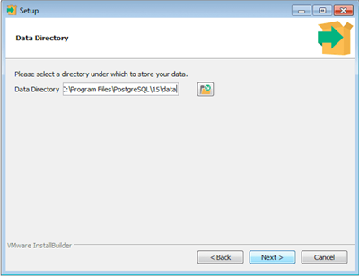
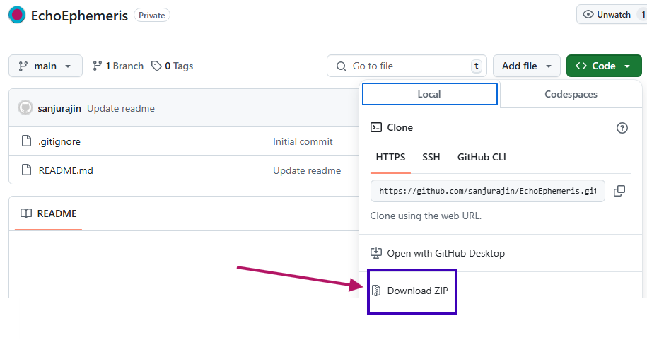
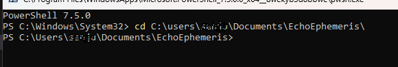

Made for personal use (Arvind Bhai inspired me).

<!--  -->
# Requirerments
* Below Steps are for Windows OS (For macOS :- Almost Same. For Linux :- Do you really need)
## 1. Install python on you PC 
       Download from https://www.python.org/downloads/
       Installation Help https://www.geeksforgeeks.org/how-to-install-python-on-windows/
 2. Install PostgreSQL
        Dowmnload from https://www.enterprisedb.com/downloads/postgres-postgresql-downloads
        Installation Help
        https://www.enterprisedb.com/docs/supported-open-source/postgresql/installing/windows/
        Note :- i. Installation Location -  
                
                ii. It will ask location for Data Directory, Change it where you want the database to be like D Drive.
                
                iii. Ensure to put Password during installation, It is essential
                
# Other optional installations

## 3. Install Power Shell using Windows Store 
        https://apps.microsoft.com/detail/9MZ1SNWT0N5D?hl=en-us&gl=IN&ocid=pdpshare
        (Its optional, Still Install you will appriciate me later )
## 4. Install Git (Any one from below) 
        https://desktop.github.com/download/  (Prefered)
        https://git-scm.com/downloads
        You can also use other alternatives too, search for it.
## 4. Install VS Code 
        https://code.visualstudio.com/download
        Not Require though
<!--  -->
# Now the SETUP Phase

# 1. Get Project Folder
        Clone Method
        Open GitHub Desktop
        Click on File --> Clone Repository
        enter repo address & Clone

        Manual Method
        Click on Code (see above) and Download Zip
        Extract the Folder somewher (This location will be used more frequent)
        

## 2. Open the folder (Extracted or Cloned)
        Go to file creden.txt at \EchoEphemeris\app
        replace third line my_password with your password, you entered during PostgreSQL Installation
## 3. Open Command Prompt/Power Shell and go to extracted folder
 
## 4. write below commands one by one and enter
        py -m venv venv
        .\venv\Scripts\activate
        pip install -r requirements.txt
        python .\schema_db.py  
        python .\initial_setup.py   

## 5. Every time to run the web/app Open Power Shell
        .\venv\Scripts\activate
        flask run --debug

